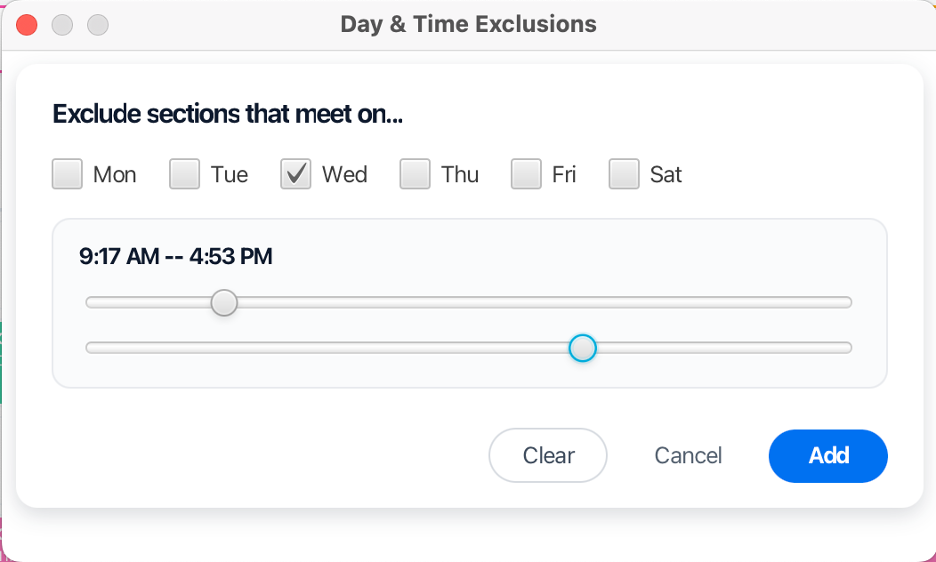
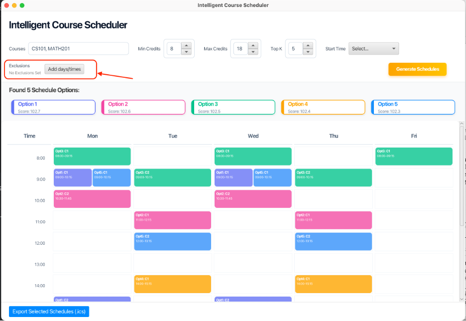
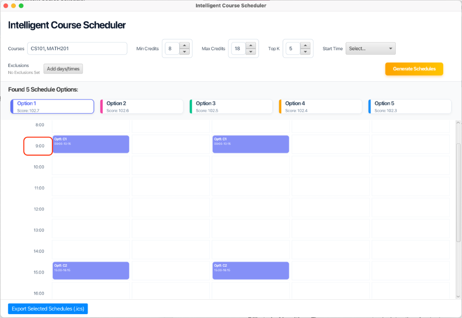
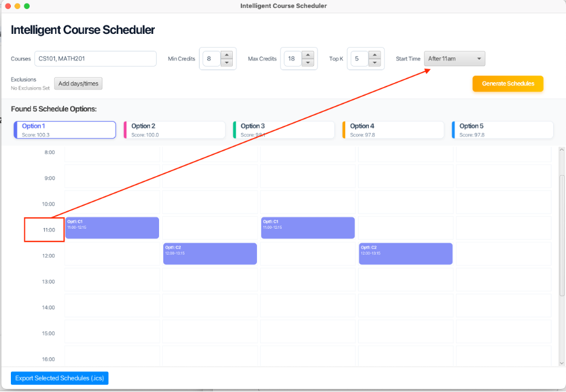
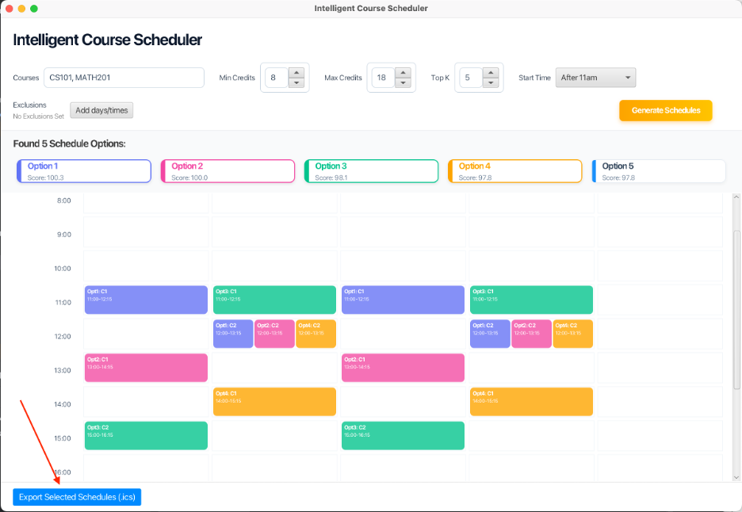
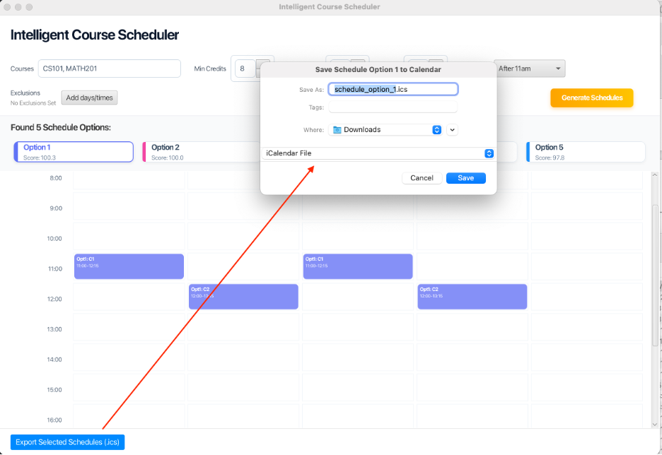
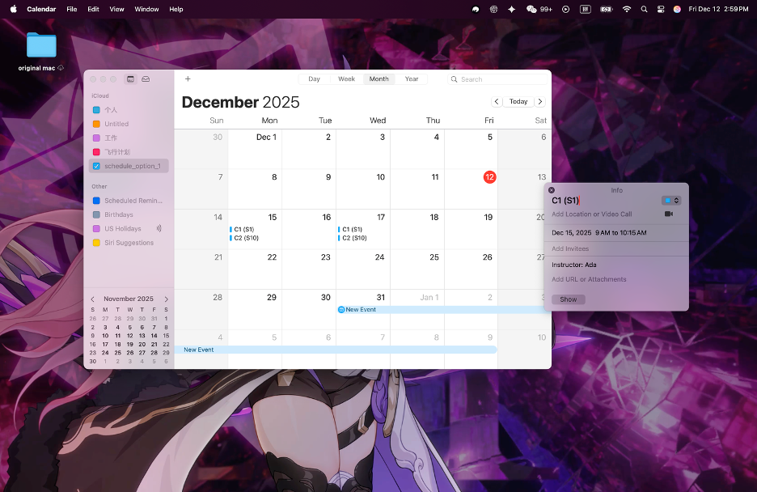

# Intelligent Course Scheduler

A production-grade course scheduling system that generates optimal student schedules from 10,000+ course/section combinations using constraint-based optimization, Dijkstra pathfinding, and multithreaded search.

<p align="center">
  
</p>

## Features

- **Constraint-Based Scheduling**:
  - **Hard Constraints**: Detects time conflicts and strictly adheres to user-defined exclusion periods (e.g., "No classes on Fridays").
  - **Soft Constraints**: Optimizes schedules based on user preferences (e.g., "Start after 11am") using a weighted scoring algorithm.
- **Native iCalendar Export**: Generates RFC 5545 (`.ics`) files for seamless integration with Apple Calendar, Google Calendar, and Outlook.
- **Pathfinding**: Uses Dijkstra's algorithm to optimize travel time between buildings
- **REST API**: Spring Boot REST service with H2 (dev) and MySQL (prod) support
- **JavaFX Client**: Modern GUI for schedule generation and visualization
- **Multithreaded Search**: Parallel combinatorial search with pruning
- **Database Migrations**: Flyway for schema management

## Feature Showcase

### 1. Exclusion Constraints (Hard Constraints)
Users can interactively define time blocks to exclude. The system prunes invalid branches immediately.

| **Constraint Entry** | **Interactive Filter** |
|:---:|:---:|
|  |  |

### 2. Preference Optimization (Soft Constraints)
Comparison of default scheduling vs. preference-based scheduling.

| **Default (Earliest Possible)** | **Optimized (After 11am)** |
|:---:|:---:|
|  |  |
| *System defaults to 9:00 AM start* | *System prioritizes 11:00 AM start (Score: 100.3)* |

### 3. Calendar Export
Full interoperability workflow.

| **Export Action** | **System Save Dialog** | **macOS Calendar Result** |
|:---:|:---:|:---:|
|  |  |  |

---

## Prerequisites

- Java 17 or higher
- Maven 3.9+

## Project Structure

```
intelligent-course-scheduler/
├── common/          # Shared DTOs
├── engine/          # Core algorithms (Dijkstra, conflict detection, scheduling)
├── server/          # Spring Boot REST API
└── client/          # JavaFX GUI client
```

## Build & Test

```bash
# Build all modules
mvn clean install -DskipTests

# Run all tests
mvn test
```

## Running the Application

### 1. Start the Server

```bash
cd server
mvn spring-boot:run
```

The server will start on `http://localhost:8080`

Check health endpoint:
```bash
curl http://localhost:8080/actuator/health
```

### 2. Run the JavaFX Client

In a new terminal:

```bash
cd client
mvn javafx:run
```

Or use the exec plugin:
```bash
mvn exec:java -Dexec.mainClass="com.ics.client.ClientApp"
```

### 3. Test the API Directly

```bash
curl -X POST http://localhost:8080/api/schedules/generate \
  -H "Content-Type: application/json" \
  -d '{
    "courseCodes": ["CS101", "MATH201"],
    "prefs": {
      "minCredits": 8,
      "maxCredits": 8,
      "bannedWindows": [],
      "maxWalkPerGap": 12
    },
    "topK": 5
  }'
```

## Architecture

### Engine Module
- **Dijkstra**: Shortest path calculation between buildings
- **TimeConflictDetector**: O(n log n) conflict detection per day
- **ScheduleGenerator**: Backtracking search with pruning
- **ScheduleScorer**: Scoring function (extensible for travel time, preferences)

### Server Module
- Spring Boot REST API
- JPA entities with H2 database
- Flyway migrations for schema management
- Sample seed data (2 courses, 4 sections, 2 buildings)

### Client Module
- JavaFX application
- Non-blocking API calls with progress indicators
- Schedule visualization

## Database Schema

The application uses Flyway migrations. The initial schema includes:
- `buildings`: Building information with campus and coordinates
- `courses`: Course catalog
- `sections`: Course sections with meeting times
- `section_meetings`: Individual meeting time slots
- `edges`: Building-to-building walking times

## Sample Data

The seed script includes:
- 2 buildings: Main Hall (B1), Science Ctr (B2)
- 2 courses: CS101, MATH201
- 4 sections with various meeting times
- Building edges with 8-minute walk time

## Development

### Running Tests

```bash
# Run engine tests
cd engine
mvn test

# Run server tests
cd server
mvn test
```

### Code Style

The project uses standard Java conventions. To add Spotless:

```xml
<plugin>
  <groupId>com.diffplug.spotless</groupId>
  <artifactId>spotless-maven-plugin</artifactId>
  <version>2.40.0</version>
  <configuration>
    <java>
      <googleJavaFormat/>
    </java>
  </configuration>
</plugin>
```

## License

This is a demonstration project for educational purposes.


